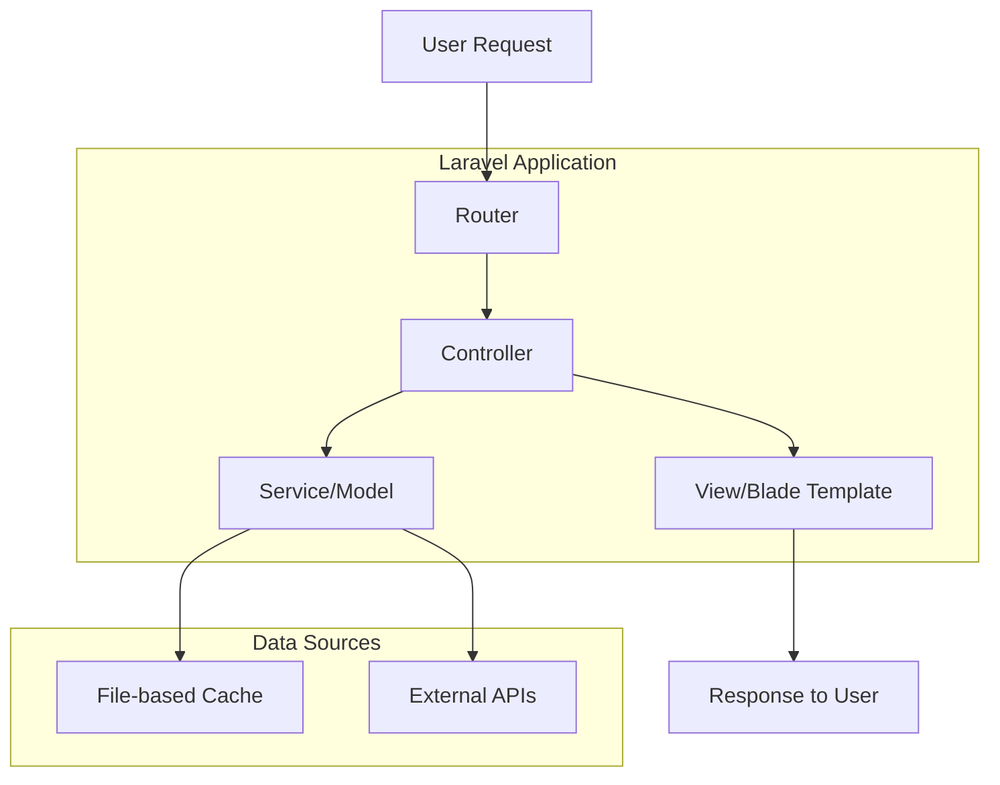

# MyQuran Laravel Refactor - Project Summary

## Project Overview
This document summarizes the complete plan for refactoring the existing CodeIgniter MyQuran application to Laravel while preserving all functionality and replacing database operations with file-based caching using JSON files.

## Current Status
- ✅ Analyzed existing CodeIgniter MyQuran application structure
- ✅ Created detailed architecture and implementation plans
- ⏳ Ready to begin implementation phase

## Architecture Overview

## Implementation Plan Summary

### Phase 1: Environment Setup
- Set up storage directory structure for JSON cache files
- Migrate static assets to public directory
- Configure file permissions

### Phase 2: Cache Management System
- Create CacheService for file-based caching
- Implement JSON file reading/writing with caching
- Set up directory structure in storage/app/cache/

### Phase 3: Data Layer
- Refactor QuranModel with file caching
- Implement all data methods from original model
- Set up external API integrations

### Phase 4: Controller Layer
- Create controllers matching CodeIgniter functionality
- Implement all existing routes and methods
- Ensure data flow matches original application

### Phase 5: View Layer
- Migrate all views to Blade templates
- Maintain AMP compatibility
- Ensure responsive design

### Phase 6: API Integration
- Implement Alquran.cloud API for Quran data
- Implement MyQuran.com API for prayer times
- Implement Equran.id API for tafsir data
- Implement Telegram API for bot functionality

### Phase 7: Search Functionality
- Implement search across Quran text
- Implement search across Hadits text

### Phase 8: Testing and Optimization
- Test all functionality against original application
- Optimize caching mechanisms
- Finalize performance improvements

## File Migration Strategy

### JSON Data Files (to storage/app/cache/)
- ../myquran/inc/quran.json → storage/app/cache/quran/data.json
- ../myquran/inc/doa.json → storage/app/cache/prayers/doa.json
- ../myquran/inc/tahlil.json → storage/app/cache/prayers/tahlil.json
- ../myquran/inc/lokasi.json → storage/app/cache/locations/lokasi.json
- ../myquran/inc/books/*.json → storage/app/cache/hadits/*.json

### Static Assets (to public/inc/)
- Images, fonts, audio files, JavaScript, and CSS files

## Key Components to Implement

### 1. CacheService
Handles all file-based caching operations with proper TTL and invalidation.

### 2. QuranModel
Reimplements all data methods from the original CodeIgniter model with file caching.

### 3. Controllers
- QuranController: All Quran-related functionality
- HaditsController: All Hadits-related functionality
- BotController: Telegram bot functionality
- WelcomeController: Authentication and general pages

### 4. Views
Complete migration of all AMP and bot views to Blade templates.

## Timeline Estimate
With the detailed plan in place, the implementation can be completed in phases:

1. Environment Setup: 1-2 days
2. Cache Management System: 2-3 days
3. Data Layer: 3-4 days
4. Controller Layer: 3-4 days
5. View Layer: 4-5 days
6. API Integration: 2-3 days
7. Search Functionality: 1-2 days
8. Testing and Optimization: 2-3 days

**Total Estimated Time: 20-25 days**

## Next Steps
1. Review this plan and provide feedback
2. Approve switching to Code mode for implementation
3. Begin with Phase 1: Environment Setup

## Approval
Please confirm if you're satisfied with this plan and would like to proceed with the implementation.