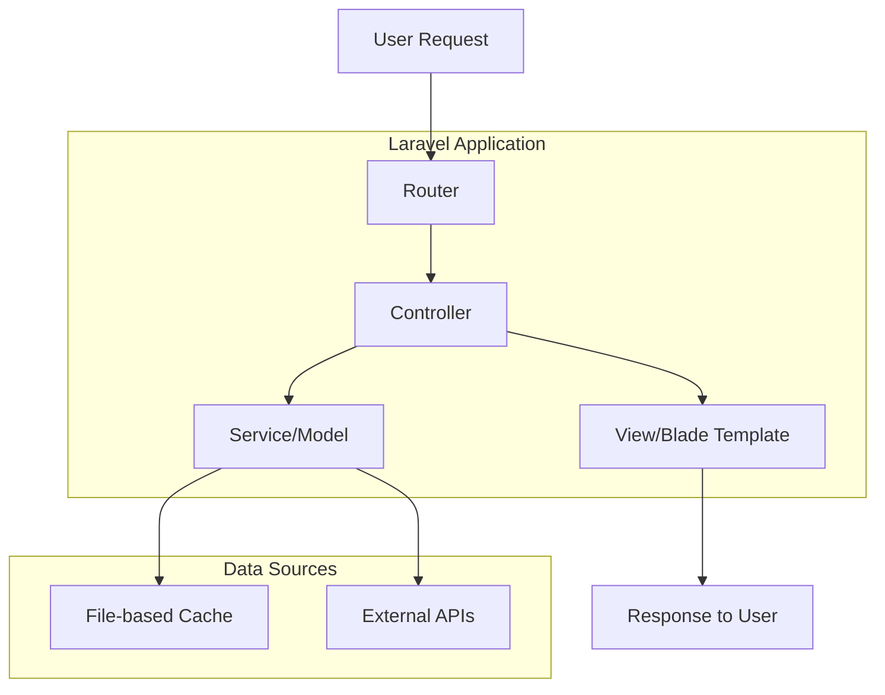

# MyQuran Laravel Refactor Plan

## Project Overview
This document outlines the plan for refactoring the existing CodeIgniter MyQuran application to Laravel while preserving all functionality and replacing database operations with file-based caching using JSON files.

## Architecture Overview



## Directory Structure
```
myquran-lara/
├── app/
│   ├── Http/
│   │   ├── Controllers/
│   │   │   ├── QuranController.php
│   │   │   ├── HaditsController.php
│   │   │   ├── BotController.php
│   │   │   └── WelcomeController.php
│   │   └── routes/
│   ├── Models/
│   │   └── QuranModel.php
│   ├── Services/
│   │   └── CacheService.php
│   └── Helpers/
├── resources/
│   ├── views/
│   │   ├── amp/
│   │   ├── bot/
│   │   └── layouts/
│   └── assets/
├── storage/
│   └── app/
│       └── cache/
│           ├── quran.json
│           ├── hadits/
│           ├── doa.json
│           ├── tahlil.json
│           └── lokasi.json
└── inc/ (symlink or copy from original project)
```

## Key Components

### 1. Cache Management System
- Replace database operations with file-based JSON caching
- Store Quran data, Hadits data, and other static content as JSON files
- Implement caching mechanism similar to existing CodeIgniter caching

### 2. Controllers
- QuranController: Handle all Quran-related requests
- HaditsController: Handle all Hadits-related requests
- BotController: Handle Telegram bot functionality
- WelcomeController: Handle authentication and general pages

### 3. Models/Services
- QuranModel: Handle data operations for Quran content
- CacheService: Manage file-based caching operations
- ApiService: Handle external API integrations

### 4. Views
- Migrate all AMP views to Blade templates
- Maintain existing design and functionality
- Implement responsive design principles

## Implementation Steps

### Phase 1: Setup and Configuration
1. Configure Laravel for file-based caching
2. Set up directory structure for cache files
3. Create cache management service

### Phase 2: Data Layer
1. Migrate QuranModel functionality to Laravel
2. Implement file-based caching for all data operations
3. Set up external API integrations

### Phase 3: Controller Layer
1. Create controllers matching existing CodeIgniter functionality
2. Implement all existing routes and methods
3. Ensure data flow matches original application

### Phase 4: View Layer
1. Migrate all views to Blade templates
2. Maintain AMP compatibility
3. Ensure responsive design

### Phase 5: Testing and Optimization
1. Test all functionality against original application
2. Optimize caching mechanisms
3. Finalize performance improvements

## Data Migration Strategy

### Static Data Files
- quran.json: Complete Quran data with translations
- hadits/*.json: Individual Hadits book files
- doa.json: Daily prayers data
- tahlil.json: Tahlil prayers data
- lokasi.json: Location data for prayer times

### Cache Structure
```
storage/app/cache/
├── quran/
│   ├── surah_list.json
│   ├── juz_1.json
│   ├── surah_1.json
│   └── metadata.json
├── hadits/
│   ├── bukhari.json
│   ├── muslim.json
│   └── ...
├── prayers/
│   ├── doa.json
│   └── tahlil.json
└── locations/
    └── lokasi.json
```

## API Integration
- Alquran.cloud API for Quran data
- MyQuran.com API for prayer times
- Telegram API for bot functionality
- Equran.id API for tafsir data

## Performance Considerations
- Implement efficient caching with file modification time checks
- Use Laravel's built-in caching for frequently accessed data
- Optimize JSON file reading with proper indexing
- Implement lazy loading for large data sets